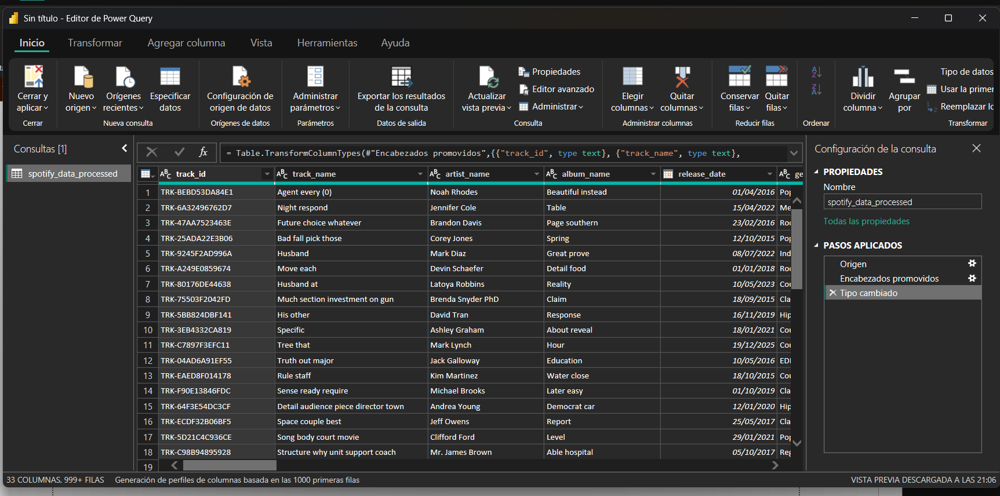
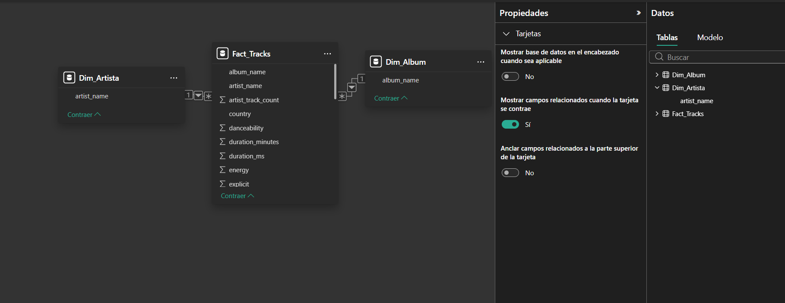
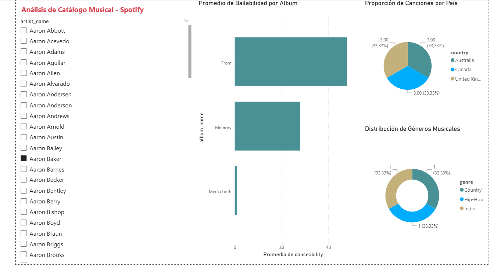

# Tarea 2: Construcción de dashboard analítico en Power BI

**Universidad de San Carlos de Guatemala (USAC)**  
**Facultad de Ingeniería - Escuela de Ciencias y Sistemas**  
**Seminario de Sistemas 2**  
**Estudiante:** Engel Emilio Coc Raxjal  
**Carne:** 202200314

**Repositorio:** `SS22S2026_G14` 

---

## 1. Descripción detallada del dataset y origen de los datos
Para el desarrollo de este dashboard analítico, se extrajo un dataset desde el repositorio público de Kaggle, específicamente el archivo `spotify_data_processed.csv` (20.35 MB). Este conjunto de datos proporciona una vista exhaustiva del catálogo musical, estructurado inicialmente como un archivo plano (denormalizado) que consta de 33 columnas y miles de registros.

El valor de este dataset radica en la combinación de metadatos descriptivos estándar (nombres de pistas, artistas, álbumes y fechas de lanzamiento) con métricas avanzadas de análisis de audio generadas por los algoritmos de la plataforma. Variables cuantitativas como `danceability`, `energy` y `duration_ms` permiten realizar un análisis profundo sobre la composición instrumental, el enfoque de producción de las pistas y las tendencias rítmicas. Esta estructura lo convierte en un insumo ideal para aplicar procesos ETL (Extracción, Transformación y Carga) y construir un modelo multidimensional que soporte la toma de decisiones estratégicas en la industria musical.

## 2. Proceso de Transformación y Modelado de Datos (Power Query)
Para asegurar la integridad referencial y optimizar el rendimiento de las consultas DAX en Power BI, se transicionó de una arquitectura de tabla plana hacia un modelo multidimensional clásico basado en un **Esquema en Estrella**. El proceso detallado fue el siguiente:

### A. Extracción y Limpieza Inicial
1. **Conexión de Datos:** Se utilizó el conector nativo de *Texto/CSV* de Power BI para importar el archivo `spotify_data_processed.csv`.
2. **Tipado de Datos (Data Typing):** Dentro del Editor de Power Query, se realizó una auditoría de los tipos de datos asignados automáticamente. Se corrigieron formatos clave, garantizando, por ejemplo, que campos temporales como `release_date` pasaran de formato texto (ABC) a formato Fecha, lo cual es vital para futuras implementaciones de inteligencia de tiempo.

### B. Construcción de Dimensiones (Tablas de Búsqueda)
Para normalizar la base de datos, se extrajeron las entidades descriptivas principales aislando sus valores únicos:
1. **Creación de `Dim_Artista`:** Se duplicó la consulta principal. Se eliminaron todas las columnas exceptuando `artist_name`. Posteriormente, se aplicó la función *Quitar duplicados* para consolidar un catálogo de llaves primarias únicas por artista.
2. **Creación de `Dim_Album`:** Se repitió el proceso de duplicación sobre la consulta origen, conservando únicamente la columna `album_name` y eliminando redundancias para establecer la dimensión de los proyectos discográficos.

### C. Consolidación de la Tabla de Hechos
* **`Fact_Tracks`:** La consulta original fue renombrada y optimizada para fungir como la tabla de hechos central. Esta tabla conserva los identificadores únicos de las canciones (`track_id`), las llaves foráneas (`artist_name`, `album_name`) y todas las medidas cuantitativas continuas (ej. `danceability`, `energy`, recuentos).

### D. Modelado Relacional
En la vista de Modelo de Power BI, se establecieron las relaciones lógicas para habilitar la propagación del filtro cruzado:
* Se conectó el campo `artist_name` de `Dim_Artista` con su homólogo en `Fact_Tracks` (Relación 1 a *).
* Se conectó el campo `album_name` de `Dim_Album` con su homólogo en `Fact_Tracks` (Relación 1 a *).
* La dirección del filtro cruzado se mantuvo como única, fluyendo desde las dimensiones hacia la tabla de hechos, garantizando la correcta evaluación de las medidas en el lienzo.

## 3. Capturas del dashboard

## 4. Interpretación Analítica de los Indicadores (KPIs)
El lienzo visual fue diseñado para responder a preguntas de negocio específicas mediante el cruce de variables dimensionales. El dashboard interactivo se compone de un segmentador principal y tres visualizaciones clave:

### Segmentador de Datos (Filtro Interactivo)
* **Campo utilizado:** `artist_name` (proveniente de `Dim_Artista`).
* **Función:** Permite aislar el contexto de evaluación de todo el dashboard para analizar el comportamiento y las métricas de un solo artista a la vez (ej. el análisis específico del catálogo de "Aaron Baker").

### Visualización 1: Promedio de Danceability por Álbum (Gráfico de Barras Horizontales)
* **Estructura:** Eje Y (`album_name`), Eje X (Promedio de `danceability`).
* **Interpretación Estratégica:** Este KPI compara el enfoque rítmico y de producción entre distintos álbumes. Durante la construcción, se aplicó una corrección crítica: se modificó la función de agregación predeterminada de *Suma* a *Promedio*. Si se usara la suma, un LP de 20 canciones siempre superaría a un EP de 5 canciones, creando un falso positivo en el análisis. Al usar el promedio, obtenemos la media real de la "bailabilidad", permitiendo identificar con precisión qué proyecto discográfico fue producido con un enfoque más orientado al movimiento y pistas rítmicas.

### Visualización 2: Distribución de Pistas por País (Gráfico Circular)
* **Estructura:** Leyenda (`country`), Valores (Recuento de pistas).
* **Interpretación Estratégica:** Muestra el peso porcentual y la penetración de mercado regional de los tracks. En la segmentación actual, se evidencia una distribución perfectamente equitativa (33.33%) dividida entre los mercados de Australia, Canadá y el Reino Unido. Esto indica una estrategia de distribución o una popularidad balanceada en estas tres regiones anglosajonas de la Commonwealth.

### Visualización 3: Diversificación de Géneros Musicales (Gráfico de Anillo)
* **Estructura:** Leyenda (`genre`), Valores (Recuento de género).
* **Interpretación Estratégica:** Desglosa el catálogo filtrado para ilustrar la versatilidad de la composición. Actualmente muestra una división exacta en tercios para los géneros *Country*, *Hip-Hop* e *Indie*. Este equilibrio refleja una producción altamente variada que no se encasilla en un solo estilo, lo cual es un indicador importante para estrategias de marketing y ubicación en playlists curadas dentro de las plataformas de streaming.

